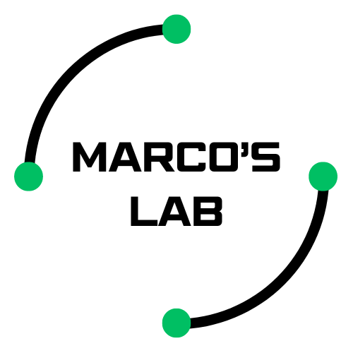

## Marco's Lab

I am an electrical engineer.

During my free time I love doing my own personal engineering projects. I think it is the best way to keep learning and exploring all this engineering world of ours has to offer

In this repo you will find the repos of the projects.
Feel free to look around.
Hope you will find something interesting.

And if you want I am always open to hear your opinion and cosntructive feedback.

If you want you can also follow me on instagram.

<!--
**themarcolab/themarcolab** is a ✨ _special_ ✨ repository because its `README.md` (this file) appears on your GitHub profile.

Here are some ideas to get you started:

- 🔭 I’m currently working on ...
- 🌱 I’m currently learning ...
- 👯 I’m looking to collaborate on ...
- 🤔 I’m looking for help with ...
- 💬 Ask me about ...
- 📫 How to reach me: ...
- 😄 Pronouns: ...
- ⚡ Fun fact: ...
-->
